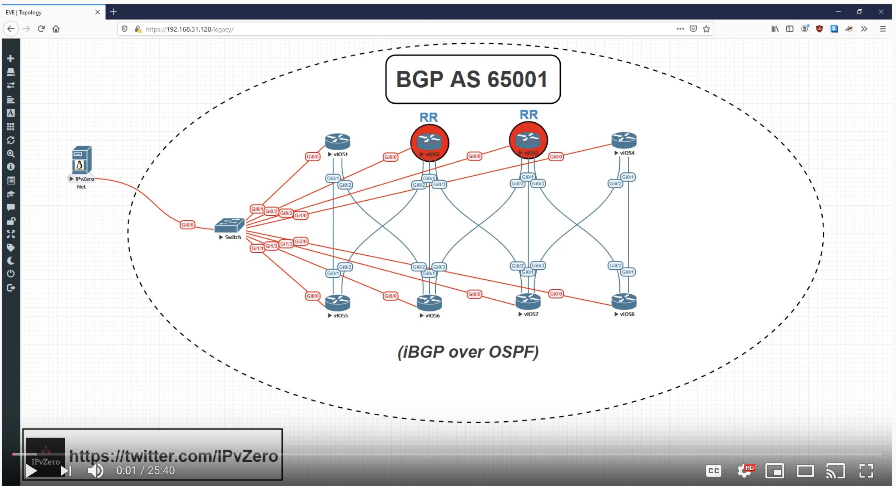

# Intro to Genie

This code is based off my video Introduction To Genie video, for set up please see this video

[](https://youtu.be/THgHwS-zVt8 "Introduction to Genie | Python Network Automation!")

## Instructions

### Dependencies

git clone https://github.com/kepkin/dev-shell-essentials.git

```
sudo nano .bashrc

alias zx='highlight green "+" | highlight red "-"'

cd dev-shell-essentials
source dev-shell-essentials.sh
```


### Use Case Description


### About me
I am a Youtube content creator and Cybersecurity & Networks student with a strong interest in NetDevOps/Automation/Programmability
Follow me on [Twitter](https://twitter.com/IPvZero) and [YouTube](https://www.youtube.com/channel/UCQ7d_M3T1TdVX3Nnxp6wmAA)

