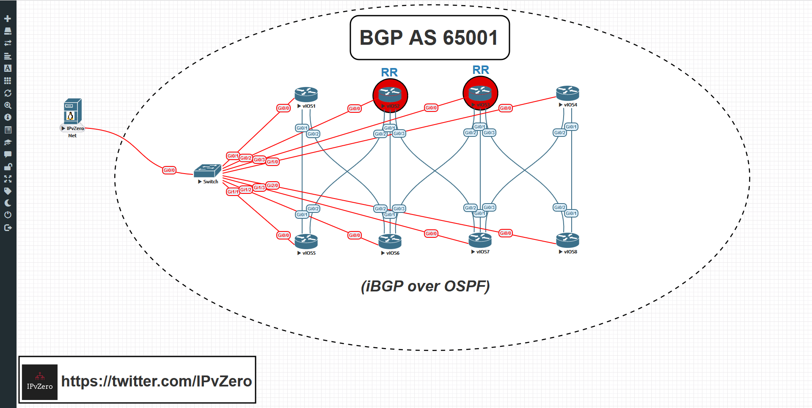
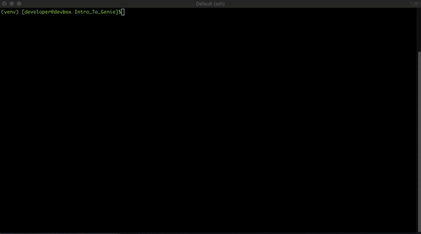
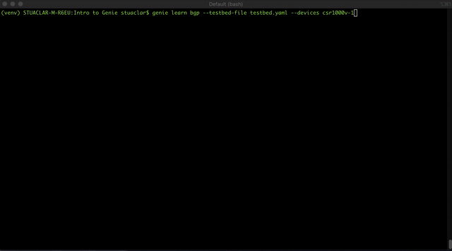
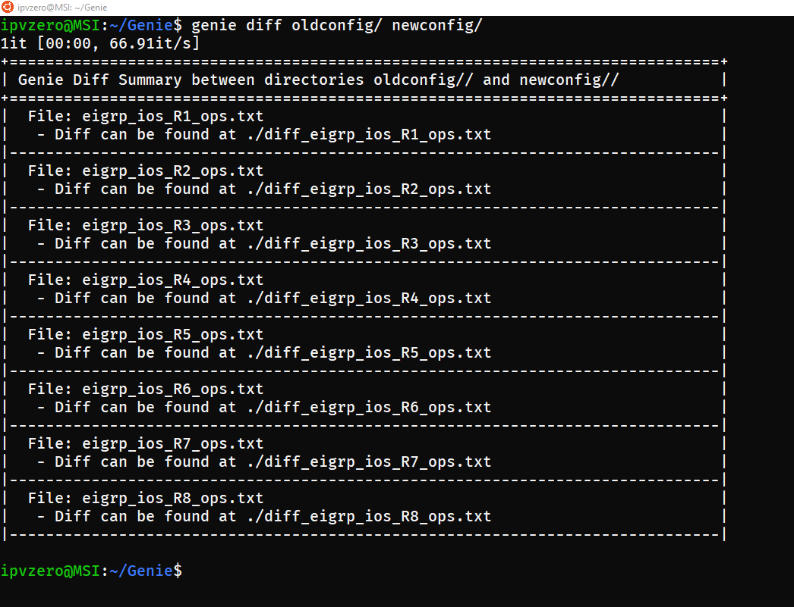

# Intro to Genie

This code is based off my video [Introduction To Genie](https://www.youtube.com/watch?v=THgHwS-zVt8) video. 

For instructions on how to setup the initial lab environment, please see this video:

[](https://www.youtube.com/watch?v=XQBZoy61j2g "How To Setup A Network Automation Environment")

## Instructions

### DevNet Sandbox
All code has been tested on the Cisco DevNet Multi-IOS Cisco Test Network Sandbox [HERE](https://devnetsandbox.cisco.com/RM/Diagram/Index/6b023525-4e7f-4755-81ae-05ac500d464a?diagramType=Topology) Please see the sandbox pages for credentials and reservations, virl default passwords are used on all routers (cisco/cisco). This demo example is based on Python 3.6 and was tested successfully under that version.

```
SSH Host - 10.10.20.50
Default Credentials – developer/C1sco12345
```
```
git clone https://github.com/IPvZero/Intro_To_Genie.git
cd Intro_To_Genie
```
```
virtualenv venv --python=python3.6
source venv/bin/activate
```

From the `Intro_To_Genie` directory

```
# Get a list of currently running simulations
virl ls --all

# Stop any running simulations.
virl down --sim-name <Simulation name>

# Start the VIRL Simulation for demo
virl up

# Monitor status of simulation
virl nodes   # Node startup
```



### Local Code
All of the code and examples for this are located in this directory. Clone and access it with the following commands on your local machine
```
git clone https://github.com/IPvZero/Intro_To_Genie.git
cd Intro_To_Genie
```

### Local Python Environment Setup
It is recommended that this demo be completed using Python 3.6.
It is highly recommended to leverage Python Virtual Environments for completing exercises in this course.

Follow these steps to create and activate a venv.

#### OS X or Linux
```
virtualenv venv --python=python3.6
source venv/bin/activate
```

### Install the code requirements
```
pip install -r requirements.txt
```
Test cases: Learn about all BGP sessions in each device, check their status and build a table to represent that info 



### Use Case Description

Genie diff command, allows you to make quick yet stateful comparisons of your device operational states pre/post changes. Imagine for instance, that you kept a copy of your known-good device operational state in a repository. When your network is misbehaving, probe again and compare:



### About me
I am a Youtube content creator and Cybersecurity & Networks student with a strong interest in NetDevOps/Automation/Programmability
Follow me on [Twitter](https://twitter.com/IPvZero) and [YouTube](https://www.youtube.com/channel/UCQ7d_M3T1TdVX3Nnxp6wmAA)

